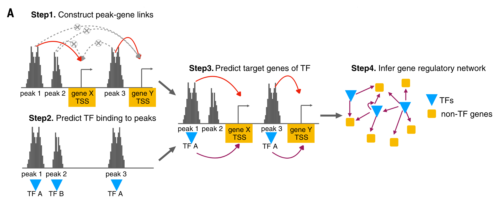
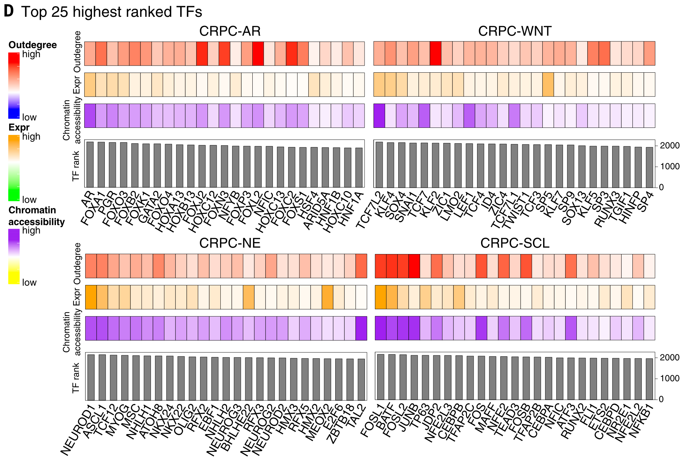
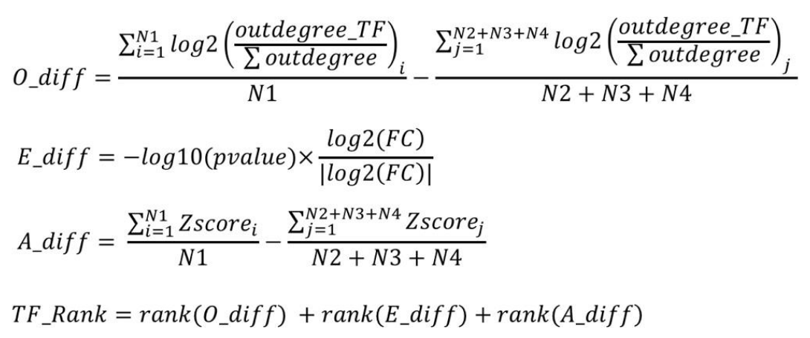

```{r setup}
#| message: false
library(tidyverse)
library(broom)
library(ggVennDiagram)
library(glue)
library(knitr)
library(patchwork)
library(plotly)
library(rlang)
library(scales)
library(tidyverse)
theme_sovacool <- ggplot2::theme_bw() +
    ggplot2::theme(
      legend.margin = ggplot2::margin(0, 0, 0, 0, unit = "pt"),
      legend.box.margin = ggplot2::margin(0, 0, 0, 0, unit = "pt"),
      panel.spacing = unit(1, 'lines'),
      plot.margin = ggplot2::margin(0, 0, 0, 0, unit = "pt"),
      strip.background = element_blank(),
      strip.placement = 'outside'
    )
theme_set(theme_sovacool)

set.seed(20240326)
```


## Accomplished

- Construct TF-peak network with TF footprints from HINT-ATAC.
  - Previously used TOBIAS, which only reported TF-TF networks rather than all TF-gene relationships.
- Link ATAC peaks to genes from RNA expression with similar method as Tang _et al._.
  - Previously: select peaks in promoter regions of gene TSSs (**2kbp** window)
  - Now: select peaks within a **0.5mbp** window around gene TSSs to include promoters _and_ enhancers.
    - Run Pearson correlation on peak scores & gene counts, filter peak-gene links by FDR < 0.01.
- Re-rank top TFs per cluster.

## Network construction from Tang _et al._



## Key TFs per cluster from Tang _et al._



## Calculation of key TFs per cluster



:::{.notes}
Tang _et al._ Suppl. pg. 8
:::

## Previously with TOBIAS

```{r TFs_TOBIAS}
plot_heatmap_row <- function(dat, value_column = A_diff,
                             scale_fill = scale_fill_viridis_c) {
  dat %>%
    ggplot(aes(
      x = gene_name, y = 1, # y = diff,
      fill = {{ value_column }}
    )) +
    geom_tile() +
    facet_wrap(~cluster_id, nrow = 1, scales = "free") +
    labs(
      y = quo_name(enquo(value_column)),
      x = ""
    ) +
    theme(
      axis.text.x = element_text(angle = 60, vjust = 1, hjust = 1),
      axis.text.y = element_blank(),
      axis.ticks.y = element_blank(),
    )
}
top_tfs_tobi <- read_csv(params$top_tfs_tobias)

# plot TFs patchwork
(plot_heatmap_row(top_tfs_tobi, outdegree) +
  colorspace::scale_fill_continuous_diverging(palette = 'Blue-Red',
                                              #limits = c(-10.5,10.5)
                                              ) +
  theme(axis.text.x = element_blank())
) /
  (plot_heatmap_row(top_tfs_tobi, expression) +
    colorspace::scale_fill_continuous_diverging(palette = 'Green-Orange',
                                                #limits = c(-7.31,7.31)
                                                ) +
    theme(
      axis.text.x = element_blank(),
      strip.text = element_blank()
    )
  ) /
  (plot_heatmap_row(top_tfs_tobi, accessibility) +
       colorspace::scale_fill_continuous_diverging(palette = 'Purple-Green',
                                                   #limits = c(-20,20)
                                                   )  +
    theme(strip.text = element_blank()))
```

## Now with HINT-ATAC

```{r TFs_HINT}
top_tfs_hint <- read_csv(params$top_tfs_hint)

# plot TFs patchwork
(plot_heatmap_row(top_tfs_hint, outdegree) +
  colorspace::scale_fill_continuous_diverging(palette = 'Blue-Red') +
  theme(axis.text.x = element_blank())
) /
  (plot_heatmap_row(top_tfs_hint, expression) +
    colorspace::scale_fill_continuous_diverging(palette = 'Green-Orange') +
    theme(
      axis.text.x = element_blank(),
      strip.text = element_blank()
    )
  ) /
  (plot_heatmap_row(top_tfs_hint, accessibility) +
       colorspace::scale_fill_continuous_diverging(palette = 'Purple-Green')  +
    theme(strip.text = element_blank()))
```

## TF distributions - TOBIAS
```{r tf_rank_tobi}
tf_rank_tobi <- read_tsv(params$tf_ranks_tobias)
tf_rank_tobi %>%
    pivot_longer(c(A_diff, E_diff, O_diff)) %>%
    ggplot(aes(value, fill = cluster_id)) +
    geom_histogram(alpha = 0.5, position = position_identity(), bins = 20) +
    facet_wrap(~ name, scales = 'free_x') +
    labs(title = 'TOBIAS')
```

## TF distributions - HINT-ATAC
```{r tf_rank}
tf_rank_hint <- read_tsv(params$tf_ranks_hint)
tf_rank_hint %>%
    pivot_longer(c(A_diff, E_diff, O_diff)) %>%
    ggplot(aes(value, fill = cluster_id)) +
    geom_histogram(alpha = 0.5, position = position_identity(), bins = 20) +
    facet_wrap(~ name, scales = 'free_x') +
    labs(title = 'HINT-ATAC')
```

## Next

- Double-check matching of atac-seq & rna-seq sample IDs.
  - Matched 28 of 39 sample IDs between ATAC-seq and RNA-seq.
  - For most peak-gene pairs, both an ATAC-seq and RNA-seq count could only be found for 12 of 39 samples.
- How were consensus peaks merged and selected?
